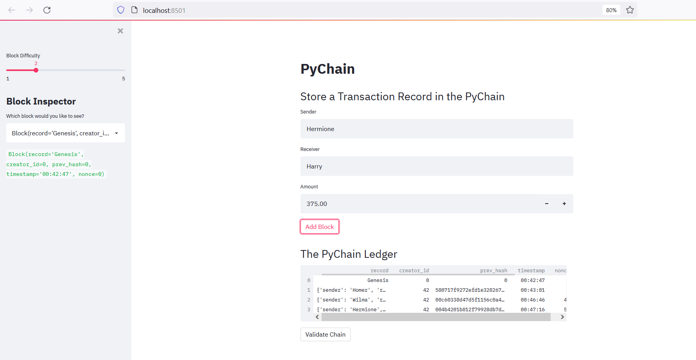
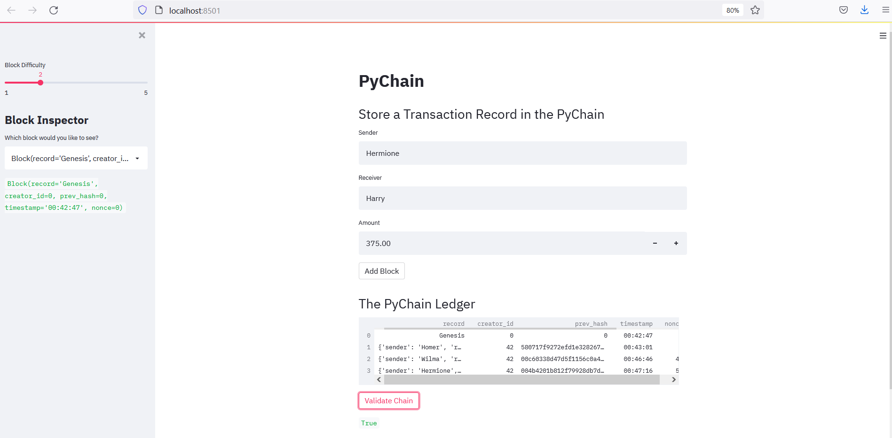

# Blockchain1

This code simulates a blockchain on a single computer

Note that there is an issue printing out the data frame using streamlit.  I had to manually convert the entries in the record and prev_hash columns to string type to get it to work.  This issue was also present in the code for the activities during the module.

Screenshot showing a blockchain with several blocks:

Screenshot confirming validity of the blockchain:

